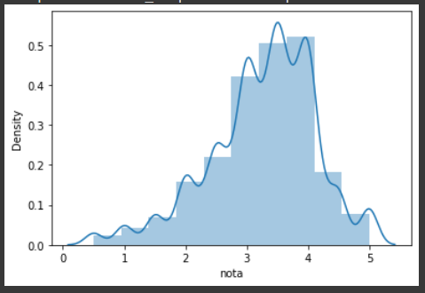

# Analise-de-Filmes
Analizando Filmes de um dataBase

## O que foi feito nesse projeto 

#### Aqui foi pego uma base de Dados de notas de Filmes

#### Algumas analises estatisticas foram feitas sobre essa base e analizado de acordo.

#### Nesse Grafico uma distribuição das notas de todos os usuarios 

#### Com a biblioteca Seaborn um plot da quatidade de fimes que não são de lingua inglesa

#### Colocando o mesmo plot acima em ordem decrescente. 

# Conclusões

"Vimos no grafico de caixa, que aparentemente o filme Toy Story foi melhor aceito em termos de notas do que o filme Jumanji,

<strong> Porém </strong>

Para essa análise a média não é relevante, pois ela não indica uma preferência de notas dadas.

Apesar dessas analises não podemos correlacionar os dois filmes citados (toy story e Jumanji), pois suas dimenções são muito discrepantes uma da outra."