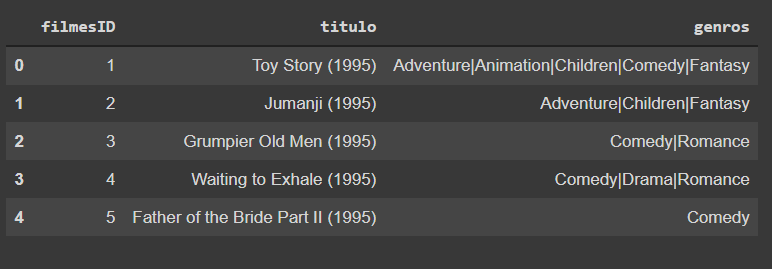
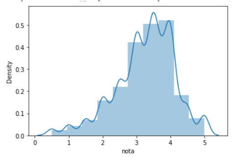

# Analise-de-Filmes
Analizando Filmes de um dataBase

## O que foi feito nesse projeto 

#### Aqui foi pego uma base de Dados de notas de Filmes
  

#### Algumas analises estatisticas foram feitas sobre essa base e analizado de acordo.  

#### Nesse Grafico uma distribuição das notas de todos os usuarios 
  

#### Com a biblioteca Seaborn um plot da quatidade de fimes que não são de lingua inglesa
  

#### Colocando o mesmo plot acima em ordem decrescente. 

# Conclusões

Vimos analises estatísticas basicas nesse projeto, e també que nem sempre uma metodo vai ser relevante em uma análise.
